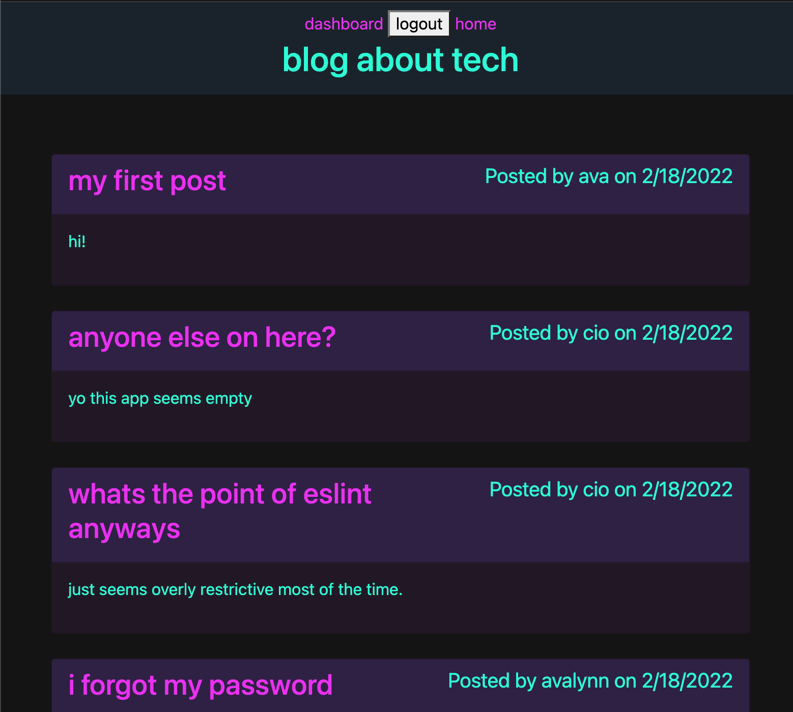

# blog about tech

## Description

This program is designed to be a blog that allows people to post blogs on code. this assignment is incomplete due to lack of assistance and an excess of project requirements in not nearly enough provided time.

## Table of Contents

- [Installation](#installation)
- [Usage](#usage)
- [Contributing](#contributing)
- [License](#license)
- [Questions](#questions)

## Installation

Clone this project your personal computer using the command: 

	git clone git@github.com:avalynnw/ORM-back-end.git

Then, use: 

	npm i

 to install the required dependencies in the root directory.

## Usage

Seed the database in mysql to start off with: 

    mysql -u root -p

in the root directory and enter the set password. 

Then, run

    source db/schema.sql

to create the database. 

run 

    quit

to exit the sql shell.

Run

    npm run seed

to seed the database.

Run the program from the root directory using:

	npm run watch

and follow the promts to interact with the database.

## Contributing

Collaborators: Avalynn Helgrave, https://github.com/avalynnw

Third-Party Assets: Modules: express, sequalize

## License

#### The Unlicense

http://unlicense.org/

## Questions

https://github.com/avalynnw

 Contact me at: avalynnjudge@gmail.com
